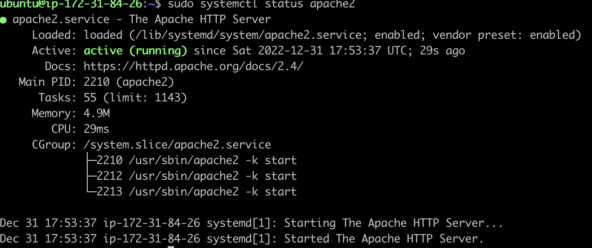
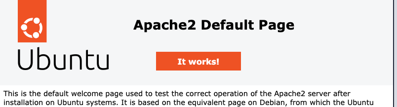
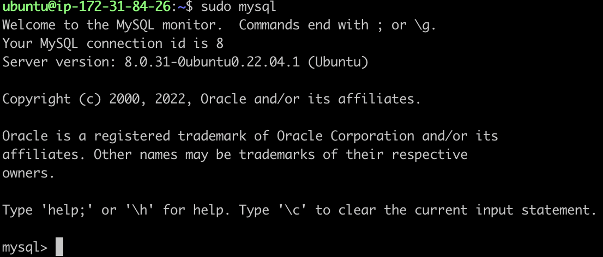
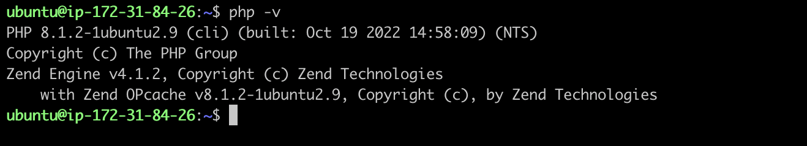
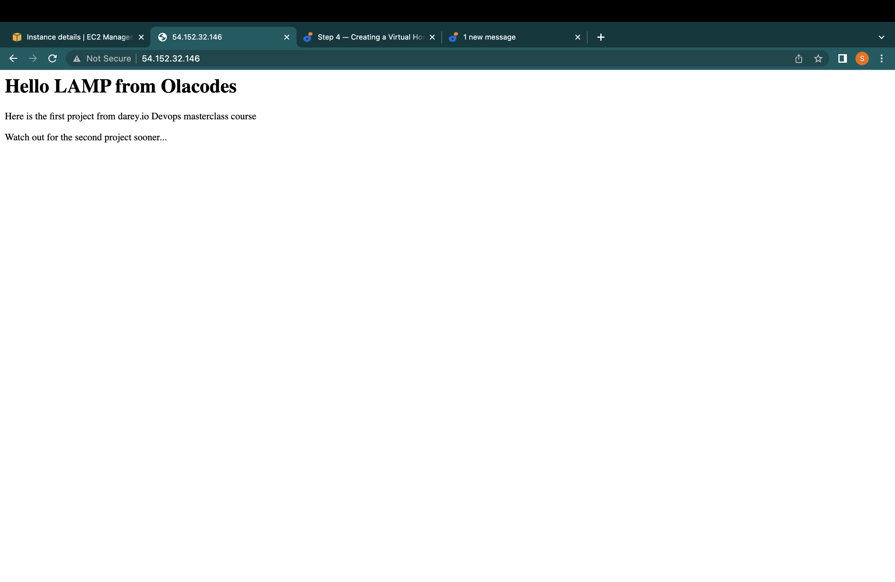
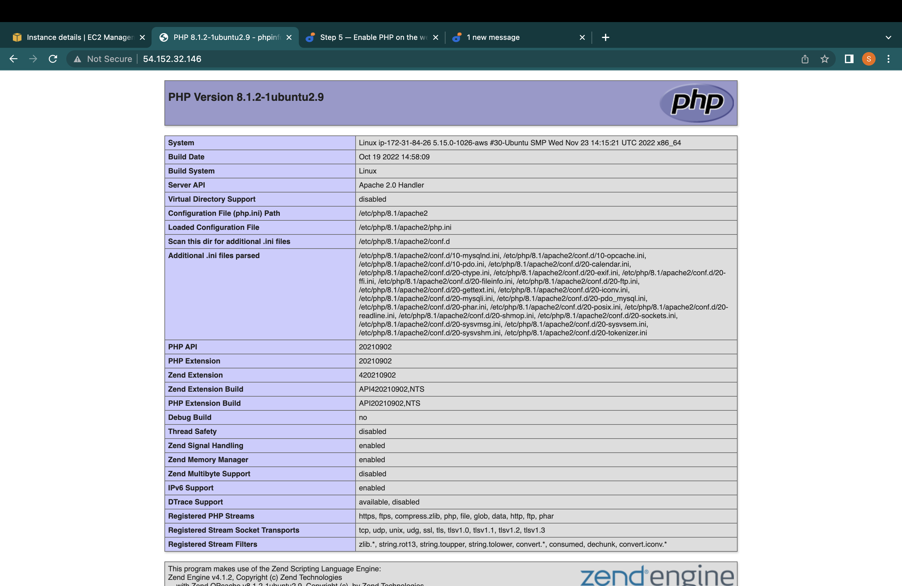

# LAMP STACK IMPLEMENTATION

In this project we are to deploy a simple web application using the LAMP technology stack and should be accessible over the internet.

The LAMP technology stack stand for:

- L --> Linux
- A --> Apache
- M --> MySQL
- P --> PHP or Python or Perl

## DevOps Technologies used

- AWS CLI --> [Command Line Interface](https://docs.aws.amazon.com/cli/latest/userguide/cli-chap-welcome.html)
- AWS EC2 --> [Elastic Cloud Compute](https://docs.aws.amazon.com/AWSEC2/latest/UserGuide/concepts.html)

## DEPLOYMENT PROCESS WITH SCREEN SHOTS

STEP 1: Create a free AWS account, Instantiate an EC2 and connect to it via SSH

- Create a free AWS account and setup it cli
- Create an EC2 instance
- Connect to the EC2 via [ssh](https://docs.aws.amazon.com/AWSEC2/latest/UserGuide/AccessingInstancesLinux.html)

STEP 2: Install Apache and Update the Firewall

```bash
#update a list of packages in package manager
sudo apt update

#run apache2 package installation
sudo apt install apache2

# Verify apache2 is running
sudo systemctl status apache2
```

- You should have this result



- Open inbound connection on port 80 and access and we can access it through

  - locally with curl in our ubuntu shell `curl http://localhost:80 or curl http://127.0.0.1:80`
  - From the internet `http://<Public-IP-Address>:80`.
    You should see apache2 detail page like below



STEP3: Installing MySQL

- Use `sudo apt install mysql-server` to install MySQL
- Test if MySQL is properly installed with `sudo mysql`
- You should see the image bellow



- Secure mysql with the following commands

`ALTER USER 'root'@'localhost' IDENTIFIED WITH mysql_native_password BY 'PassWord.1';`

then exit mysql shell and run `sudo mysql_secure_installation` for validation and follow the prompt to set new strong password

Then login with the new password with `sudo mysql -p`

STEP4: Install PHP

```bash
# install 3 php packages
sudo apt install php libapache2-mod-php php-mysql

# Check the version of php
php -v
```



STEP 5: CREATING A VIRTUAL HOST FOR YOUR WEBSITE USING APACHE

- Create the directory for projectlamp using ‘mkdir’ command as follows: `sudo mkdir /var/www/projectlamp`
- Next, assign ownership of the directory with your current system user: `sudo chown -R $USER:$USER /var/www/projectlamp`
- Then, create and open a new configuration file in Apache’s sites-available directory using your preferred command-line editor. Here, we’ll be using vi or vim (They are the same by the way): `sudo vim /etc/apache2/sites-available/projectlamp.conf`
- Paste the following virtual host configuration in it.

```bash
<VirtualHost *:80>
    ServerName projectlamp
    ServerAlias www.projectlamp
    ServerAdmin webmaster@localhost
    DocumentRoot /var/www/projectlamp
    ErrorLog ${APACHE_LOG_DIR}/error.log
    CustomLog ${APACHE_LOG_DIR}/access.log combined
</VirtualHost>
```

- You can now use a2ensite command to enable the new virtual host: `sudo a2ensite projectlamp`

- To disable Apache’s default website use a2dissite command , type:
  `sudo a2dissite 000-default`

- To make sure your configuration file doesn’t contain syntax errors, run:
  `sudo apache2ctl configtest`

- Finally, reload Apache so these changes take effect:
  `sudo systemctl reload apache2`

- Your new website is now active, but the web root /var/www/projectlamp is still empty

  - Create an index.html file in that location so that we can test that the virtual host works as expected:
  - Edit the index.html file and put your html document

- Then you can access you page in `http://<Public-IP-Address>:80` or `http://<Public-DNS-Name>:80`



STEP 6: ENABLE PHP ON THE WEBSITE

With the default DirectoryIndex settings on Apache, a file named index.html will always take precedence over an index.php file.

To change this you have to edit the **DirectoryIndex** in this file `sudo vim /etc/apache2/mods-enabled/dir.conf` e.g

```bash
<IfModule mod_dir.c>
        #Change this:
        #DirectoryIndex index.html index.cgi index.pl index.php index.xhtml index.htm
        #To this:
        DirectoryIndex index.php index.html index.cgi index.pl index.xhtml index.htm
</IfModule>
```

After saving and closing the file, you will need to reload Apache so the changes take effect: `sudo systemctl reload apache2`

To use PHP, Create a new file named index.php inside your custom web root folder:

`vim /var/www/projectlamp/index.php`

This will open a blank file. Add the following text, which is valid PHP code, inside the file:

```php
<?php
phpinfo();
```

This will show the PHP project information page.



## QUESTIONS

1. The deployed site only works on `http` and not `https`
2. Why the public IPv4 link provided by AWS uses https while the actual url is http
